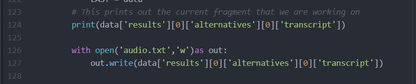
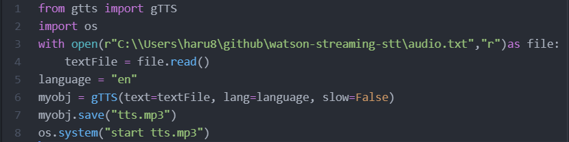
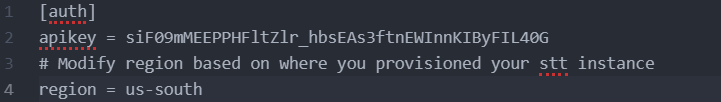

# STTandTTSchatbot
This repository is about speech-to-text and text-to-speech chatbot and it include 5 files

#### 1.transcribe.py:
it is a python file that takes the voice speech and convert it to text and save it as txt file

#### 2.audio.txt:
It is a txt file that inclde the converted speech

#### 3.TextToSpeech.py:
It is a python file that takes the written text and convert it to audio speech and save it as mp3 file

#### 4.tts.mp3:
It is an mp3 file that includes the converted text

#### 5.speech.cfg
It includes the priorityes pf the watson speech

## Referances
 * For the speech to text code: https://www.youtube.com/watch?v=YCyuZM454_I
 * For the Text to speech code: https://www.youtube.com/watch?v=_Q8wtPCyMdo&feature=youtu.be

